# Installation von Menyoo

## Schritt 1: Backup GTA

Bevor du Änderungen vornimmst, sichere dein GTA V-Verzeichnis. So kannst du bei Problemen jederzeit den Originalzustand wiederherstellen.

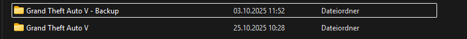

---

## Schritt 2: Tools laden

Du benötigst drei Tools für die Modding-Grundlage:

- **OpenIV**: [OPEN IV](https://openiv.com/) – zum Bearbeiten von GTA-Dateien
- **Menyoo SP**: [Menyoo SP](https://www.gta5-mods.com/tools/menyoo-pc-sp) – für Szenenbau und Objektplatzierung
- **ScriptHookV**: [ScriptHookV](http://www.dev-c.com/gtav/scripthookv/) – ermöglicht das Ausführen von Mods

---

## Schritt 3: OpenIV installieren

Starte die OpenIV-Installation und wähle dein GTA V-Verzeichnis aus.

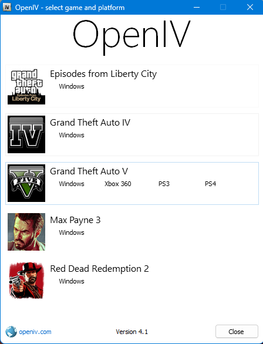

Pfad zur GTA-Installation auswählen:

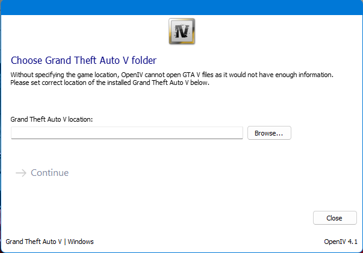

Erfolgreiche Verknüpfung:

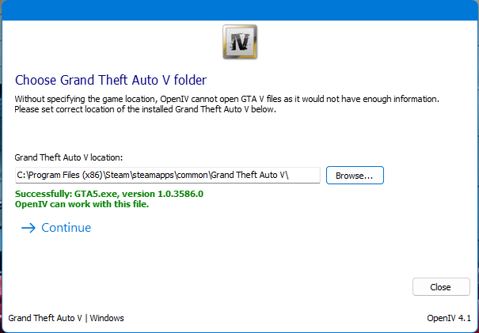

Aktiviere den ASI Manager über „Tools“ → „ASI Manager“:

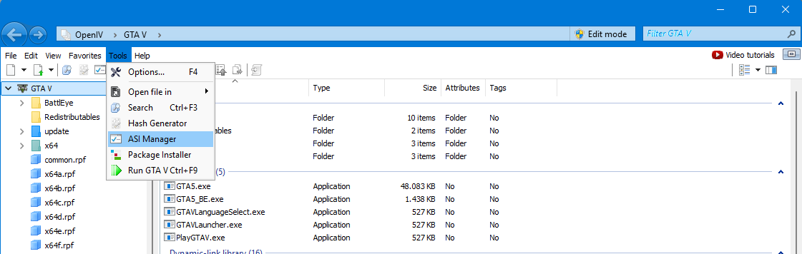

Installiere alle drei ASI-Plugins:

- `ASI Loader`
- `OpenIV.asi`
- `OpenCamera.asi` (optional)

Vorher:

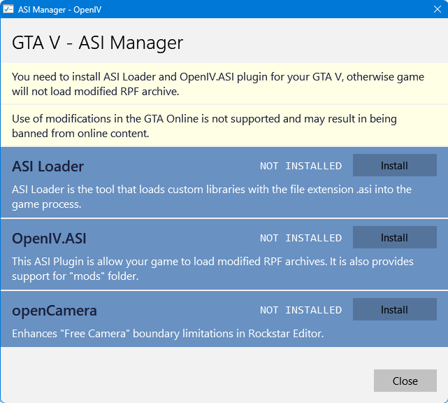

Nachher:

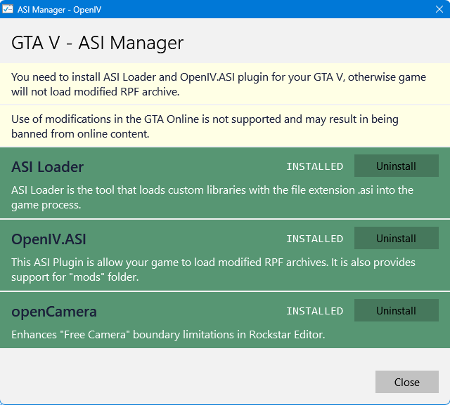

---

## Schritt 4: ScriptHookV installieren

Lade ScriptHookV herunter und entpacke die Dateien. Kopiere `ScriptHookV.dll` und `dinput8.dll` in dein GTA V-Hauptverzeichnis.

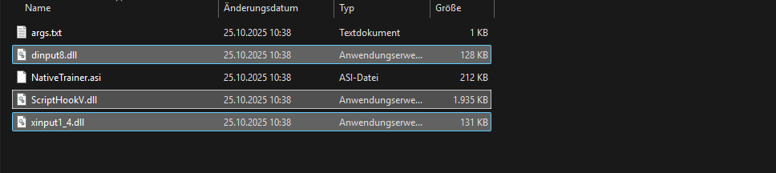

Zielverzeichnis:

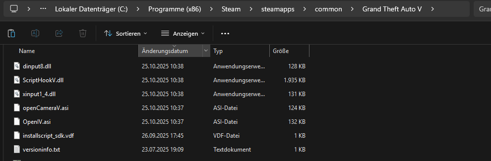

---

## Schritt 5: Menyoo SP installieren

Lade Menyoo SP herunter und kopiere die Datei `Menyoo.asi` sowie den Ordner `menyooStuff` in dein GTA V-Hauptverzeichnis.

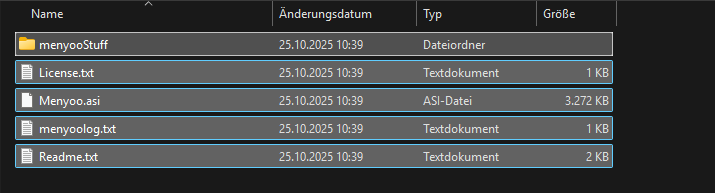

Zielverzeichnis:

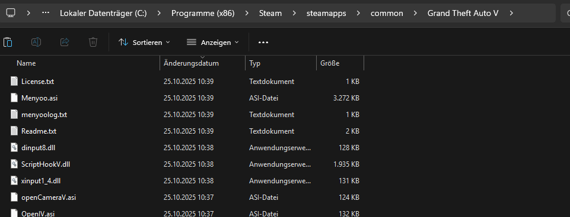

---

## Schritt 6: Battleye ausschalten

Falls du GTA V über Epic Games oder Rockstar Launcher nutzt, deaktiviere Battleye.

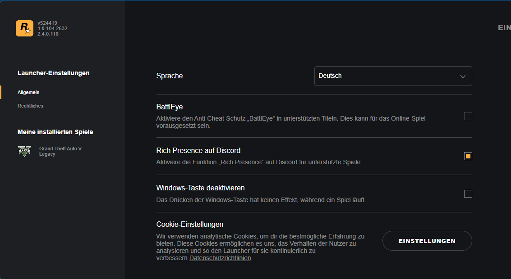

---

## Schritt 7: Spiel starten und Menyoo öffnen

Starte GTA V. Sobald du im Spiel bist, drücke `F8`, um das Menyoo-Menü zu öffnen. Du kannst nun Szenen erstellen, Objekte platzieren und Animationen abspielen.

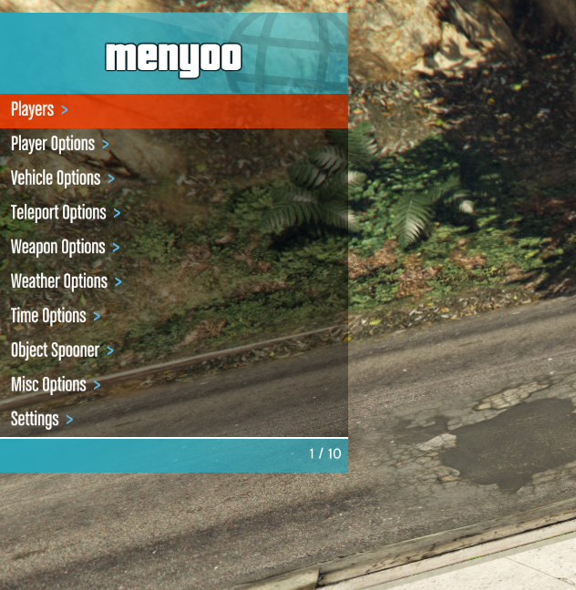
